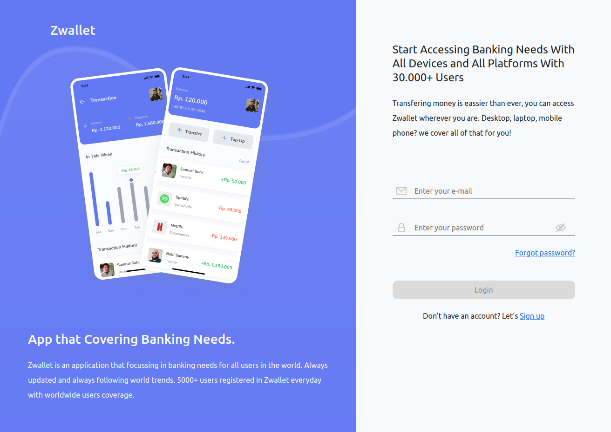
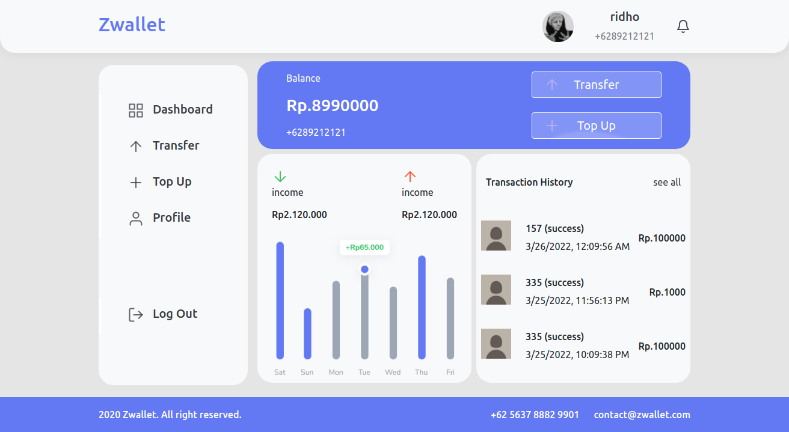
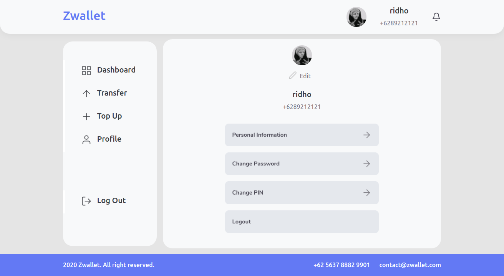

# Zwallet

**Zwallet** adalah dompet digital yang menyederhanakan kebutuhan finansial anda dan dapat menghemat banyak waktu dalam kebutuhan perbankan hanya dengan menggunakan Zwallet.


## Built With

- [React.js]
- [Mysql]
- [Express.js]
- [Node.js]


## Installation

1. Clone the repo
   ```sh
   git clone https://github.com/pilarhh/blanja-app.git
   ```
2. Install NPM packages
   ```sh
   npm install
   ```
3. Start the Application
   ```sh
   npm start
   ```

## Demonstration

Demo : https://bit.ly/ZwalletSite

email : ridho99@gmail.com || password : 123


## FEATURES

Authentication & Authorization

Topup

Transfer

Realtime Balance

Upload Image Profile

Reset Password

PIN Security while Transfer

Realtime Notification in Completed Transfer or Topup

Change Password

Change Pin

Change Name

## Snippets

Here are some snippets about this app:

- Login



- Home



- Profile




